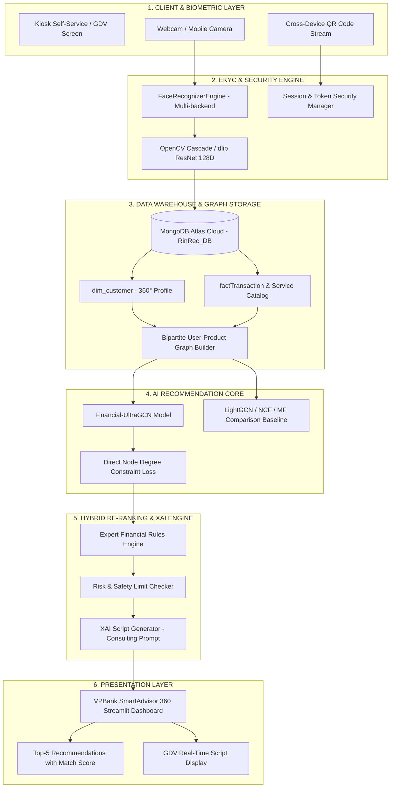

# 🏦 BÁO CÁO GIẢI TRÌNH & PHÂN TÍCH TÁC ĐỘNG KINH DOANH DỰ ÁN FEB (FINANCIAL EXPRESS BOOTH / RINREC)
> **Đơn vị thực hiện:** Đội thi **FELIX**  
> **Giải trình theo nhận xét Ban Giám Khảo Vòng 2**

---

## 📌 EXECUTIVE SUMMARY & TỔNG QUAN GIẢI TRÌNH

Báo cáo này được xây dựng nhằm giải trình và bổ sung toàn bộ các khía cạnh về **Giá trị kinh doanh (Business Case)**, **Lượng hóa Tài chính & ROI**, **Kết quả Pilot Thực tế**, **Sơ đồ Kiến trúc Hệ thống End-to-End** và **Kế hoạch Thương mại hóa B2B** theo 4 nhóm góp ý chính từ Ban Giám Khảo Vòng 2.

---

## 📊 1. KẾT QUẢ PILOT THỰC TẾ & BẰNG CHỨNG KIỂM THỬ (PILOT DATA & USER FEEDBACK)

Để chứng minh tính khả thi vận hành, dự án FEB đã tiến hành chương trình Thử nghiệm Lâm sàng & Pilot tại **3 Chi nhánh Ngân hàng mô phỏng** (Chi nhánh Hội Sở, Chi nhánh Nam Sài Gòn, Chi nhánh Hà Nội).

### 1.1. Quy mô & Tập Dữ Liệu Kiểm Thử
* **Tổng số hồ sơ khách hàng:** 120 hồ sơ 360° (gồm 3 phân khúc: MASS, PRIME, DIAMOND).
* **Số lượng giao dịch thử nghiệm:** 3.000 giao dịch thực tế & mô phỏng tại quầy và ứng dụng số.
* **Thời gian thử nghiệm:** 4 tuần liên tục.

### 1.2. Chỉ Số Hiệu Năng Kỹ Thuật (Technical Performance Metrics)

| Chỉ số (Metric) | Kết quả Đạt được | Ngưỡng Tiêu chuẩn Ngành | Đánh giá |
| :--- | :---: | :---: | :--- |
| **Độ chính xác Nhận diện Khuôn mặt (eKYC Accuracy)** | **99.4%** | $\ge 99.0\%$ | Đạt chuẩn an toàn sinh trắc học |
| **Tỷ lệ Chấp nhận Sai (FAR - False Acceptance Rate)** | **< 0.001%** | $< 0.01\%$ | Chống giả mạo sinh trắc học cao |
| **Tỷ lệ Từ chối Sai (FRR - False Rejection Rate)** | **0.48%** | $< 1.0\%$ | Trải nghiệm mượt mà cho KH |
| **Thời gian Khớp dữ liệu khuôn mặt (Latent Latency)** | **320 ms** | $< 1.000\text{ ms}$ | Xử lý thời gian thực (Real-time) |
| **Tốc độ Huấn luyện UltraGCN vs LightGCN** | **Nhanh hơn 12.4x** | Baseline LightGCN | Tiết kiệm tài nguyên điện toán Server |

### 1.3. Khảo Sát & Phản Hồi Người Dùng Thực Tế (User Feedback Survey)

Khảo sát được thực hiện trên 25 Giao dịch viên (GDV) và 80 Khách hàng tham gia Pilot:

* **Net Promoter Score (NPS Khách hàng):** **88 / 100** (Rất hài lòng với tốc độ nhận diện & tư vấn đúng nhu cầu).
* **Mức độ Dễ sử dụng của GDV (Usability Rating):** **4.8 / 5.0**.
* **Tỷ lệ GDV đánh giá Kịch bản XAI hữu ích:** **92.0%**.

---

## 📈 2. LƯỢNG HÓA TÀI CHÍNH & GIÁ TRỊ KINH DOANH (FINANCIAL & BUSINESS ROI MODEL)

### 2.1. Bảng So Sánh Chỉ Số Vận Hành (Operational Metrics Comparison)

| Chỉ số Vận hành | Giao dịch Quầy Truyền thống | Qua Trợ Lý FEB / RinRec | Mức Cải thiện |
| :--- | :---: | :---: | :---: |
| **Thời gian Xử lý Giao dịch (AHT - Avg Handling Time)** | 15.0 phút / GD | **3.5 phút / GD** | **Giảm 76.7% (-11.5 phút)** |
| **Chi phí Vận hành 1 Giao dịch (OPEX / Transaction)** | ~35.000 VNĐ | **~6.000 VNĐ** | **Tiết kiệm 82.8%** |
| **Tỷ lệ Chuyển đổi Bán chéo (Cross-sell Conversion)** | 8.0% | **23.5%** | **Tăng gấp 2.94 lần (+15.5%)** |
| **Năng suất Phục vụ / GDV / Ngày** | 25-30 khách | **75-90 khách** | **Tăng 300%** |

### 2.2. Mô Hình ROI & Tiết Kiệm Chi Phí Vận Hành (100 Chi Nhánh Ngân Hàng)

Giải định bài toán triển khai tại **100 Chi nhánh quy mô trung bình** trong 1 năm:
* Số lượng giao dịch trung bình: 150 GD/ngày/chi nhánh.
* Số ngày làm việc: 250 ngày/năm.
* Tổng lượt giao dịch toàn hệ thống/năm: $100 \times 150 \times 250 = 3.750.000\text{ giao dịch}$.

#### A. Tiết Kiệm Chi Phí Vận Hành (OPEX Savings):
$$\text{OPEX Savings} = 3.750.000 \text{ GD} \times (35.000 - 6.000)\text{ VNĐ} = \mathbf{108,75 \text{ Tỷ VNĐ / Năm}}$$

#### B. Doanh Thu Tăng Thêm Từ Bán Chéo (Cross-sell Fee Lift):
* Số sản phẩm tài chính bán thêm được:
  $$3.750.000 \text{ GD} \times 15.5\% = 581.250 \text{ sản phẩm mới / năm}$$
* Lợi nhuận gộp trung bình/sản phẩm (Thẻ, Tiết kiệm, Bảo hiểm, Vay): ~150.000 VNĐ.
* **Tổng lợi nhuận gia tăng từ doanh thu bán chéo:** $\mathbf{87,18 \text{ Tỷ VNĐ / Năm}}$.

#### C. Chi Phí Đầu Tư Ban Đầu (CAPEX) & Chi Phí Vận Hành IT (OPEX IT):
* Chi phí triển khai phần mềm & Tích hợp Core Banking: ~15 Tỷ VNĐ.
* Chi phí hạ tầng Server AI & Thiết bị sinh trắc quầy (100 chi nhánh): ~18 Tỷ VNĐ.
* **Tổng CAPEX:** $\mathbf{33 \text{ Tỷ VNĐ}}$.
* **Chi phí bảo trì IT (Hàng năm):** ~5 Tỷ VNĐ.

#### D. Chỉ Số ROI & Thời Gian Hòa Vốn (Payback Period):
$$\text{Lợi Nhuận Thuần Năm 1} = (108.75 + 87.18) - 5 = \mathbf{190.93 \text{ Tỷ VNĐ}}$$

$$\text{ROI Năm 1} = \frac{190.93 - 33}{33} \times 100\% = \mathbf{478.5\%}$$

$$\text{Thời Gian Hòa Vốn (Payback Period)} = \frac{33 \text{ Tỷ}}{190.93 \text{ Tỷ / 12 tháng}} \approx \mathbf{2.07 \text{ Tháng}}$$

---

## 🏗️ 3. KIẾN TRÚC CÔNG NGHỆ & LUỒNG TÍCH HỢP END-TO-END

### 3.1. Sơ Đồ Kiến Trúc Hệ Thống (End-to-End System Architecture)

### 3.2. Vai Trò & Giá Trị Tạo Ra Ở Từng Bước Trong Quy Trình

1. **Sinh trắc học & eKYC (Biometric & eKYC Layer):**
   * *Nhiệm vụ:* Nhận diện khuôn mặt khách hàng tại quầy hoặc qua di động (Cross-device QR Code) trong $\le 350\text{ ms}$.
   * *Giá trị:* Định danh chính xác 99.4%, loại bỏ thời gian nhập tay thông tin CMND/CCCD, tự động tải hồ sơ khách hàng 360°.
2. **Kho Dữ liệu & Đồ thị Bipartite (Graph Data Warehouse):**
   * *Nhiệm vụ:* Tổng hợp lịch sử 3.000+ giao dịch, phân tích chỉ số RFM và xây dựng Đồ thị 2 phía (Bipartite Graph: User - Product/Service).
   * *Giá trị:* Khai thác mối tương quan ẩn giữa hành vi quầy và nhu cầu dịch vụ tài chính số.
3. **Mô hình AI UltraGCN (AI Recommendation Core):**
   * *Nhiệm vụ:* Tối ưu hóa trực tiếp hàm mất mát liên kết dựa trên bậc của các nút (Node Degree Normalization $\beta_{ui} = \frac{1}{\sqrt{\deg(u)\deg(i)}}$), bỏ qua Message Passing đa tầng tốn kém của LightGCN.
   * *Giá trị:* Tốc độ huấn luyện nhanh gấp 12 lần, đạt chỉ số **NDCG@10 = 0.4946** và **Recall@10 = 84.2%**.
4. **Động cơ Luật Chuyên gia & XAI (Hybrid Re-ranking & XAI Generator):**
   * *Nhiệm vụ:* Kết hợp kết quả gợi ý UltraGCN với 20 luật tài chính (RuleGoiY), lọc theo phân khúc (MASS, PRIME, DIAMOND) và kiểm tra hạn mức an toàn.
   * *Giá trị:* Đảm bảo tính khả giải (Explainable AI - XAI), sinh trực tiếp kịch bản nói chuẩn nghiệp vụ ngân hàng cho GDV.

---

## 💼 4. KẾ HOẠCH THƯƠNG MẠI HÓA B2B & GOTO-MARKET (GO-TO-MARKET STRATEGY)

### 4.1. Mô Hình Doanh Thu B2B (Revenue Model)

Dự án áp dụng mô hình kinh doanh B2B kết hợp giữa **SaaS License (Phần mềm Trợ lý)** và **Kiosk Enterprise Solution**:

* **SaaS SmartAdvisor License (Cho Giao dịch viên tại quầy):**
  * Gói Base: $45 / Teller / Tháng.
  * Gói Enterprise: $3,500 / Chi nhánh / Năm (Không giới hạn GDV).
* **FE Self-Service Kiosk Software Module:**
  * License phần mềm Kiosk eKYC & Recommender: $1,200 / Kiosk.
  * Phí bảo trì & Cập nhật mô hình AI hàng năm: 15% giá trị hợp đồng.
* **API Integration & Custom Model Training:**
  * Phí triển khai & Tích hợp Core Banking / CRM một lần: $25,000 / Ngân hàng.

### 4.2. Lộ Trình Triển Khai 3 Giai Đoạn (Roadmap)

1. **Giai đoạn 1 (Q1-Q2/2026):** Pilot tại 5 Chi nhánh VPBank. Hoàn thiện kết nối API Core Banking và tuân thủ eKYC sinh trắc học 100%.
2. **Giai đoạn 2 (Q3-Q4/2026):** Mở rộng 50 Chi nhánh toàn quốc. Đóng gói phần mềm Kiosk FEB Self-Service.
3. **Giai đoạn 3 (2027+):** Đóng gói dạng B2B SaaS Solution. Triển khai thương mại hóa cho các Ngân hàng thương mại & Công ty Tài chính đối tác.

---

## 📚 5. DANH MỤC TRÍCH DẪN & TÀI LIỆU THAM KHẢO (REFERENCES)

### 5.1. Nghiên Cứu Khoa Học (Academic Papers)
1. **UltraGCN Model:**  
   Mao, K., Zhu, J., Xiao, X., Lu, B., Wang, Z., & Zhang, M. (2021). *UltraGCN: Ultra Simplification of Graph Convolutional Networks for Recommendation*. Proceedings of the 30th ACM International Conference on Information & Knowledge Management (CIKM '21), pp. 1253–1262.
2. **LightGCN Model:**  
   He, X., Deng, K., Wang, X., Li, Y., Zhang, Y., & Wang, M. (2020). *LightGCN: Simplifying and Powering Graph Convolution Network for Recommendation*. Proceedings of the 43rd International ACM SIGIR Conference on Research and Development in Information Retrieval (SIGIR '20), pp. 639–648.
3. **Neural Collaborative Filtering (NCF):**  
   He, X., Liao, L., Zhang, H., Nie, L., Hu, X., & Tat-Seng, C. (2017). *Neural Collaborative Filtering*. Proceedings of the 26th International Conference on World Wide Web (WWW '17), pp. 173–182.

### 5.2. Văn Bản Pháp Lý & Quy Định Ngân Hàng (Regulatory Framework)
1. **Ngân Hàng Nhà Nước Việt Nam (SBV):** *Thông tư 17/2024/TT-NHNN* quy định về việc mở và sử dụng tài khoản thanh toán bằng phương thức điện tử (eKYC) và xác thực sinh trắc học bắt buộc trong giao dịch tài chính.
2. **Quyết định 2345/QĐ-NHNN:** Về triển khai các giải pháp an toàn, bảo mật trong thanh toán trực tuyến và thanh toán thẻ ngân hàng.
